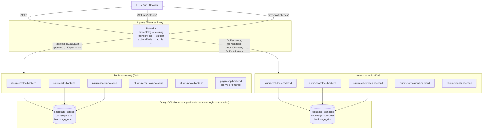

# Backstage — Divisão do Backend (Multi-Backend)

> Projeto: backstage-poc | Atualizado: 2026-05-13

---

## 1. O problema atual

O modelo de implantação atual é um **monolito**: um único container carrega o frontend e o backend juntos, com todos os plugins registrados em um só processo.

```
╔══════════════════════════════════════════════════════════════════════════╗
║  CONTAINER ÚNICO (estado atual)                                          ║
║                                                                          ║
║  ┌────────────────────────────────────────────────────────────────────┐  ║
║  │  packages/app  (frontend React — ~200MB bundle)                    │  ║
║  └────────────────────────────────────────────────────────────────────┘  ║
║  ┌────────────────────────────────────────────────────────────────────┐  ║
║  │  packages/backend  (Node.js — TODOS os plugins)                    │  ║
║  │                                                                     │  ║
║  │   catalog · scaffolder · techdocs · auth · search · kubernetes     │  ║
║  │   notifications · signals · permissions · proxy · mcp-actions      │  ║
║  └────────────────────────────────────────────────────────────────────┘  ║
╚══════════════════════════════════════════════════════════════════════════╝
```

### Dívidas técnicas identificadas

```
┌─────────────────────────────────────────────────────────────────────────┐
│  PROBLEMA                        IMPACTO                                 │
├─────────────────────────────────────────────────────────────────────────┤
│  Build monolítico (~2GB+ RAM)    Pipeline de CI estoura memória no build │
│                                                                          │
│  Pod com todos os plugins        Alto consumo de memória por réplica     │
│                                                                          │
│  Escala horizontal do todo       Cada nova réplica duplica TODOS os      │
│                                  plugins — desperdício de recursos       │
│                                                                          │
│  Catálogo e plugins leves        O catálogo (mais exigido) compete       │
│  no mesmo processo               por CPU/memória com plugins secundários │
│                                                                          │
│  Um bug derruba tudo             Falha em qualquer plugin para o portal  │
└─────────────────────────────────────────────────────────────────────────┘
```

---

## 2. O que o Backstage suporta nativamente

A arquitetura do Backstage foi projetada desde o início para suportar múltiplos backends. A documentação oficial é explícita:

> *"You can have all features in a single one, or split things out into multiple smaller deployments, depending on your need to scale and isolate individual features."*

### Os três tipos de plugins backend

```
┌─────────────────────────────────────────────────────────────────────────┐
│  Tipo 1: Standalone plugins                                              │
│  Rodam inteiramente no navegador. Não precisam de backend.               │
│  Exemplo: Tech Radar                                                     │
└─────────────────────────────────────────────────────────────────────────┘

┌─────────────────────────────────────────────────────────────────────────┐
│  Tipo 2: Service backend plugins                                         │
│  O plugin no frontend faz chamadas para um microserviço dedicado.        │
│  Exemplo: Lighthouse → lighthouse-audit-service (PostgreSQL externo)     │
└─────────────────────────────────────────────────────────────────────────┘

┌─────────────────────────────────────────────────────────────────────────┐
│  Tipo 3: Third-party backend plugins                                     │
│  Consomem APIs SaaS externas.                                            │
│  Exemplo: Dynatrace, CircleCI, GitHub Actions                            │
└─────────────────────────────────────────────────────────────────────────┘
```

### Isolamento entre plugins

Cada plugin backend:
- Opera **completamente independente** dos demais
- Possui seu **próprio banco de dados lógico** (migrations independentes via Knex)
- Se precisa falar com outro plugin, faz via **chamada HTTP** — não por código compartilhado
- Pode ter seu próprio store de **cache** (memory, Redis, Valkey, memcache, Infinispan)

---

## 3. Topologia proposta: dois backends

### Divisão recomendada para o projeto

```
╔══════════════════════════════════════════════════════════════════════════╗
║  TOPOLOGIA MULTI-BACKEND PROPOSTA                                        ║
╠══════════════════════════════════════════════════════════════════════════╣
║                                                                          ║
║  ┌──────────────────────────────┐                                        ║
║  │  packages/app  (frontend)    │  ← container separado ou mesmo app     ║
║  └──────────────────┬───────────┘                                        ║
║                     │ /api/*                                             ║
║                     ▼                                                    ║
║            ┌────────────────┐                                            ║
║            │  Reverse Proxy │  ← Nginx / Ingress / API Gateway           ║
║            └───────┬────────┘                                            ║
║                    │                                                      ║
║          ┌─────────┴──────────┐                                          ║
║          │                    │                                          ║
║          ▼                    ▼                                          ║
║  ┌───────────────┐   ┌─────────────────────┐                            ║
║  │  backend-     │   │  backend-            │                            ║
║  │  catalog      │   │  auxiliar            │                            ║
║  │               │   │                      │                            ║
║  │  /api/catalog │   │  /api/techdocs       │                            ║
║  │  /api/search  │   │  /api/kubernetes     │                            ║
║  │  /api/auth    │   │  /api/scaffolder     │                            ║
║  │  /api/perm.   │   │  /api/notifications  │                            ║
║  │  /api/proxy   │   │  /api/signals        │                            ║
║  │  /api/app     │   │  /api/mcp-actions    │                            ║
║  └───────┬───────┘   └──────────┬───────────┘                           ║
║          │                      │                                        ║
║          ▼                      ▼                                        ║
║   PostgreSQL (DB lógico   PostgreSQL (DB lógico                          ║
║   por plugin — catalog,   por plugin — scaffolder,                       ║
║   search, auth, perms)    techdocs, notifications)                       ║
╚══════════════════════════════════════════════════════════════════════════╝
```

### Distribuição dos plugins

```
╔═══════════════════════════════╦═══════════════════════════════╗
║  backend-catalog              ║  backend-auxiliar             ║
╠═══════════════════════════════╬═══════════════════════════════╣
║  plugin-app-backend           ║  plugin-techdocs-backend      ║
║  plugin-catalog-backend       ║  plugin-scaffolder-backend    ║
║  plugin-catalog-backend-      ║  plugin-scaffolder-backend-   ║
║    module-scaffolder-         ║    module-github              ║
║    entity-model               ║  plugin-scaffolder-backend-   ║
║  plugin-catalog-backend-      ║    module-notifications       ║
║    module-logs                ║  plugin-kubernetes-backend    ║
║  plugin-auth-backend          ║  plugin-notifications-backend ║
║  plugin-auth-backend-module-  ║  plugin-signals-backend       ║
║    guest-provider             ║  plugin-mcp-actions-backend   ║
║  plugin-permission-backend    ║                               ║
║  plugin-permission-backend-   ║                               ║
║    module-allow-all-policy    ║                               ║
║  plugin-search-backend        ║                               ║
║  plugin-search-backend-       ║                               ║
║    module-pg                  ║                               ║
║  plugin-search-backend-       ║                               ║
║    module-catalog             ║                               ║
║  plugin-search-backend-       ║                               ║
║    module-techdocs            ║                               ║
║  plugin-proxy-backend         ║                               ║
╚═══════════════════════════════╩═══════════════════════════════╝
```

**Critério de divisão:** o `backend-catalog` concentra tudo que é crítico para o portal funcionar (catálogo, autenticação, busca, permissões). O `backend-auxiliar` reúne plugins com demanda menor e mais previsível.

---

## 4. Estrutura de pastas

A mudança é cirúrgica: adicionar um novo pacote sem mexer no existente.

```
backstage-poc/
│
├── packages/
│   ├── app/                        # Frontend (sem mudança)
│   │
│   ├── backend/                    # backend-catalog (evolução do atual)
│   │   └── src/
│   │       └── index.ts            # Plugins de catálogo, auth, search, proxy
│   │
│   └── backend-auxiliar/           # NOVO — plugins secundários
│       ├── src/
│       │   └── index.ts            # TechDocs, Scaffolder, Kubernetes, etc.
│       └── package.json
│
└── ...
```

---

## 5. Implementação passo a passo

### 5.1 Criar o pacote `backend-auxiliar`

O caminho mais rápido é duplicar o `packages/backend` e limpar o que não pertence.

```bash
# Na raiz do projeto
cp -r packages/backend packages/backend-auxiliar
```

Atualizar `package.json`:
```json
{
  "name": "@backstage/backend-auxiliar",
  "version": "0.0.1",
  "main": "dist/index.cjs.js",
  "scripts": {
    "start": "backstage-cli package start",
    "build": "backstage-cli package build",
    "build-image": "docker build --file package.json#backstage.dockerfileAux ."
  }
}
```

### 5.2 Editar `packages/backend/src/index.ts` (backend-catalog)

Manter apenas os plugins críticos:

```ts
import { createBackend } from '@backstage/backend-defaults';

const backend = createBackend();

// App (serve o frontend)
backend.add(import('@backstage/plugin-app-backend'));
backend.add(import('@backstage/plugin-proxy-backend'));

// Catálogo
backend.add(import('@backstage/plugin-catalog-backend'));
backend.add(import('@backstage/plugin-catalog-backend-module-scaffolder-entity-model'));
backend.add(import('@backstage/plugin-catalog-backend-module-logs'));

// Autenticação
backend.add(import('@backstage/plugin-auth-backend'));
backend.add(import('@backstage/plugin-auth-backend-module-guest-provider'));

// Permissões
backend.add(import('@backstage/plugin-permission-backend'));
backend.add(import('@backstage/plugin-permission-backend-module-allow-all-policy'));

// Busca
backend.add(import('@backstage/plugin-search-backend'));
backend.add(import('@backstage/plugin-search-backend-module-pg'));
backend.add(import('@backstage/plugin-search-backend-module-catalog'));
backend.add(import('@backstage/plugin-search-backend-module-techdocs'));

backend.start();
```

### 5.3 Editar `packages/backend-auxiliar/src/index.ts`

Apenas os plugins secundários:

```ts
import { createBackend } from '@backstage/backend-defaults';

const backend = createBackend();

// TechDocs
backend.add(import('@backstage/plugin-techdocs-backend'));

// Scaffolder
backend.add(import('@backstage/plugin-scaffolder-backend'));
backend.add(import('@backstage/plugin-scaffolder-backend-module-github'));
backend.add(import('@backstage/plugin-scaffolder-backend-module-notifications'));

// Kubernetes
backend.add(import('@backstage/plugin-kubernetes-backend'));

// Notificações
backend.add(import('@backstage/plugin-notifications-backend'));
backend.add(import('@backstage/plugin-signals-backend'));

// MCP Actions
backend.add(import('@backstage/plugin-mcp-actions-backend'));

backend.start();
```

### 5.4 Configurar o DiscoveryService

Este é o passo mais crítico. O Backstage usa um `DiscoveryService` para resolver a URL de cada plugin. Em produção com dois backends, cada um precisa saber onde o outro está.

**No `app-config.production.yaml`:**

```yaml
backend:
  baseUrl: https://backstage.bradesco.com.br
  listen:
    port: 7007

  discovery:
    endpoints:
      # Plugins que estão no backend-catalog (padrão)
      - target: https://backstage-catalog.internal/api/{{pluginId}}
        plugins:
          - catalog
          - auth
          - search
          - permission
          - proxy

      # Plugins que estão no backend-auxiliar
      - target: https://backstage-auxiliar.internal/api/{{pluginId}}
        plugins:
          - techdocs
          - scaffolder
          - kubernetes
          - notifications
          - signals
          - mcp-actions
```

> **Atenção:** o frontend precisa conseguir alcançar ambos os backends. O reverse proxy (Nginx/Ingress) roteia `/api/<plugin>` para o backend correto com base nas regras acima.

### 5.5 Configurar o Reverse Proxy / Ingress

Exemplo de regras Nginx:

```nginx
# backend-catalog
location ~ ^/api/(catalog|auth|search|permission|proxy)/ {
    proxy_pass http://backstage-catalog:7007;
}

# backend-auxiliar
location ~ ^/api/(techdocs|scaffolder|kubernetes|notifications|signals|mcp-actions)/ {
    proxy_pass http://backstage-auxiliar:7007;
}
```

Ou no Kubernetes via Ingress (NGINX Ingress Controller):

```yaml
apiVersion: networking.k8s.io/v1
kind: Ingress
metadata:
  name: backstage-ingress
  annotations:
    nginx.ingress.kubernetes.io/use-regex: "true"
spec:
  rules:
    - host: backstage.bradesco.com.br
      http:
        paths:
          - path: /api/(catalog|auth|search|permission|proxy)/.*
            pathType: ImplementationSpecific
            backend:
              service:
                name: backstage-catalog
                port:
                  number: 7007
          - path: /api/(techdocs|scaffolder|kubernetes|notifications|signals)/.*
            pathType: ImplementationSpecific
            backend:
              service:
                name: backstage-auxiliar
                port:
                  number: 7007
          - path: /
            pathType: Prefix
            backend:
              service:
                name: backstage-catalog
                port:
                  number: 7007
```

---

## 6. Dockerfiles

Cada backend precisa de um Dockerfile separado. O padrão do Backstage já usa `packages/backend/Dockerfile` — o segundo segue o mesmo modelo.

### `packages/backend-auxiliar/Dockerfile`

```dockerfile
FROM node:22-bookworm-slim

RUN --mount=type=cache,target=/var/cache/apt,sharing=locked \
    --mount=type=cache,target=/var/lib/apt,sharing=locked \
    apt-get update && apt-get install -y --no-install-recommends python3 g++ build-essential && \
    rm -rf /var/lib/apt/lists/*

ENV NODE_ENV=production

WORKDIR /app

COPY --chown=node:node yarn.lock package.json packages/backend-auxiliar/dist/bundle.tar.gz ./

RUN tar xzf bundle.tar.gz --strip-components=2 && rm bundle.tar.gz

RUN --mount=type=cache,target=/root/.yarn \
    yarn workspaces focus --all --production && rm -rf "$(yarn cache dir)"

USER node

ENTRYPOINT ["node", "packages/backend-auxiliar", "--config", "app-config.yaml", "--config", "app-config.production.yaml"]
```

### Build separado por backend

```bash
# Build apenas do backend-catalog
yarn build --filter='./packages/backend'

# Build apenas do backend-auxiliar
yarn build --filter='./packages/backend-auxiliar'

# Build dos dois em paralelo (CI)
yarn build --filter='./packages/backend' --filter='./packages/backend-auxiliar'
```

---

## 7. Deployment no Kubernetes

### Deployments e Services

```
╔══════════════════════════════════════════════════════════════════════════╗
║  KUBERNETES CLUSTER                                                      ║
║                                                                          ║
║  ┌───────────────────────────────────────────────────────────────────┐  ║
║  │  Namespace: backstage                                             │  ║
║  │                                                                   │  ║
║  │  ┌────────────────────────┐  ┌──────────────────────────────┐    │  ║
║  │  │  Deployment            │  │  Deployment                  │    │  ║
║  │  │  backstage-catalog     │  │  backstage-auxiliar          │    │  ║
║  │  │                        │  │                              │    │  ║
║  │  │  replicas: 2-4         │  │  replicas: 1-2              │    │  ║
║  │  │  requests:             │  │  requests:                   │    │  ║
║  │  │    memory: 512Mi       │  │    memory: 256Mi             │    │  ║
║  │  │    cpu: 500m           │  │    cpu: 250m                 │    │  ║
║  │  │  limits:               │  │  limits:                     │    │  ║
║  │  │    memory: 1Gi         │  │    memory: 512Mi             │    │  ║
║  │  │    cpu: 1000m          │  │    cpu: 500m                 │    │  ║
║  │  └────────────────────────┘  └──────────────────────────────┘    │  ║
║  │                                                                   │  ║
║  │  ┌────────────────────────┐  ┌──────────────────────────────┐    │  ║
║  │  │  HPA                   │  │  HPA                         │    │  ║
║  │  │  min: 2 / max: 6       │  │  min: 1 / max: 3            │    │  ║
║  │  │  target CPU: 60%       │  │  target CPU: 70%             │    │  ║
║  │  └────────────────────────┘  └──────────────────────────────┘    │  ║
║  │                                                                   │  ║
║  │  ┌───────────────────────────────────────────────────────────┐   │  ║
║  │  │  Ingress  backstage-ingress                               │   │  ║
║  │  │  Roteia /api/* para o backend correto por prefixo         │   │  ║
║  │  └───────────────────────────────────────────────────────────┘   │  ║
║  └───────────────────────────────────────────────────────────────┘  ║
╚══════════════════════════════════════════════════════════════════════════╝
```

### Exemplo de Deployment para `backend-catalog`

```yaml
apiVersion: apps/v1
kind: Deployment
metadata:
  name: backstage-catalog
  namespace: backstage
spec:
  replicas: 2
  selector:
    matchLabels:
      app: backstage-catalog
  template:
    metadata:
      labels:
        app: backstage-catalog
    spec:
      containers:
        - name: backend-catalog
          image: bradesco-registry/backstage-catalog:latest
          ports:
            - containerPort: 7007
          resources:
            requests:
              memory: "512Mi"
              cpu: "500m"
            limits:
              memory: "1Gi"
              cpu: "1000m"
          env:
            - name: POSTGRES_HOST
              valueFrom:
                secretKeyRef:
                  name: backstage-secrets
                  key: postgres-host
            - name: POSTGRES_PASSWORD
              valueFrom:
                secretKeyRef:
                  name: backstage-secrets
                  key: postgres-password
```

---

## 8. Diagrama de fluxo: roteamento de plugins



---

## 9. Impacto esperado

```
┌─────────────────────────────────────────────────────────────────────────┐
│  MÉTRICA               ANTES (monolito)    DEPOIS (multi-backend)        │
├─────────────────────────────────────────────────────────────────────────┤
│  Memória por pod       ~1.5–2 GB           ~512MB (catalog)             │
│                                            ~256MB (auxiliar)            │
│                                                                          │
│  Build de imagem       1 imagem ~2GB RAM   2 imagens ~500MB RAM cada    │
│                        (estoura pipeline)  (sem estouro)                │
│                                                                          │
│  Escala horizontal     Replica TUDO        Escala só catalog (crítico)  │
│                        por cada réplica    auxiliar escala menos        │
│                                                                          │
│  Disponibilidade       Falha em K8s plugin Falha no auxiliar não        │
│                        derruba o catálogo  impacta catálogo/auth        │
│                                                                          │
│  Custo de infra        N pods × 1.5GB      2N pods × 384MB médio        │
│                        (muito caro)        (economia de ~50%)           │
└─────────────────────────────────────────────────────────────────────────┘
```

---

## 10. Restrições e pontos de atenção

```
┌─────────────────────────────────────────────────────────────────────────┐
│  RESTRIÇÃO                      SOLUÇÃO                                  │
├─────────────────────────────────────────────────────────────────────────┤
│  Sem suporte nativo a           Configurar DiscoveryService com          │
│  multi-backend no CLI           endpoints explícitos por plugin          │
│                                 no app-config.production.yaml            │
│                                                                          │
│  Frontend precisa alcançar      Reverse proxy/Ingress roteia            │
│  ambos os backends              /api/<plugin> para o pod correto        │
│                                                                          │
│  search-backend-module-         Mantido no backend-catalog, pois        │
│  techdocs precisa indexar       ele só indexa via chamada HTTP ao        │
│  conteúdo do TechDocs           backend-auxiliar /api/techdocs          │
│                                                                          │
│  Scaffolder → Catalog           Comunicação ocorre over-the-wire:       │
│  (catalog:register action)      scaffolder chama /api/catalog/          │
│                                 — desde que o Discovery esteja correto  │
│                                                                          │
│  Secrets compartilhados         Ambos os backends precisam do mesmo     │
│                                 BACKEND_SECRET para validar tokens JWT  │
└─────────────────────────────────────────────────────────────────────────┘
```

---

## 11. Roteiro de migração

```
┌────┬────────────────────────────────────────────────────────┬──────────┐
│ #  │  Passo                                                 │  Risco   │
├────┼────────────────────────────────────────────────────────┼──────────┤
│ 1  │  Criar packages/backend-auxiliar copiando o backend   │  Baixo   │
│    │  atual e removendo plugins que ficarão no catalog     │          │
│    │                                                        │          │
│ 2  │  Mover plugins do backend atual para o correto        │  Baixo   │
│    │  (remover do backend, adicionar ao auxiliar)          │          │
│    │                                                        │          │
│ 3  │  Testar ambos localmente com portas diferentes        │  Baixo   │
│    │  (catalog: 7007, auxiliar: 7008)                      │          │
│    │                                                        │          │
│ 4  │  Criar Dockerfiles separados e testar builds          │  Médio   │
│    │  Validar que nenhum build estoura memória             │          │
│    │                                                        │          │
│ 5  │  Configurar DiscoveryService em app-config.           │  Médio   │
│    │  production.yaml com URLs de cada backend             │          │
│    │                                                        │          │
│ 6  │  Configurar Ingress/Nginx com regras de roteamento    │  Médio   │
│    │  por prefixo de plugin                                │          │
│    │                                                        │          │
│ 7  │  Deploy em ambiente de staging — validar todos        │  Alto    │
│    │  os flows: catálogo, scaffolder, techdocs, k8s        │          │
│    │                                                        │          │
│ 8  │  Ajustar HPAs e resource requests com base em         │  Baixo   │
│    │  métricas reais de staging                            │          │
│    │                                                        │          │
│ 9  │  Rollout em produção com canary ou blue/green         │  Alto    │
└────┴────────────────────────────────────────────────────────┴──────────┘
```

---

## 12. Referência rápida

```
BACKEND           PORTA   PLUGINS RESPONSÁVEIS
─────────────     ──────  ───────────────────────────────────────────────
backend-catalog   7007    catalog, auth, search, permission, proxy, app
backend-auxiliar  7008    techdocs, scaffolder, kubernetes, notifications
                          signals, mcp-actions

VARIÁVEL                  OBRIGATÓRIA EM AMBOS OS BACKENDS
──────────────────────    ──────────────────────────────────────────────
BACKEND_SECRET            Sim — tokens JWT são validados com essa chave
POSTGRES_HOST             Sim — podem apontar para o mesmo DBMS
POSTGRES_USER             Sim
POSTGRES_PASSWORD         Sim

COMANDO DE BUILD SEPARADO
──────────────────────────────────────────────────────────────────────
yarn workspace backend build-image         # imagem do backend-catalog
yarn workspace backend-auxiliar build-image  # imagem do auxiliar
```

---

*Documento gerado a partir da análise da arquitetura do projeto e da documentação oficial do Backstage.*