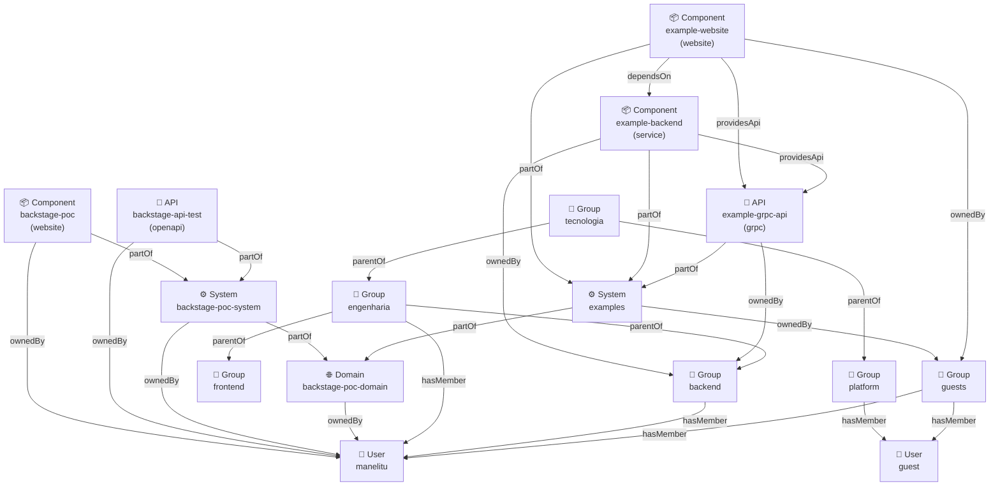
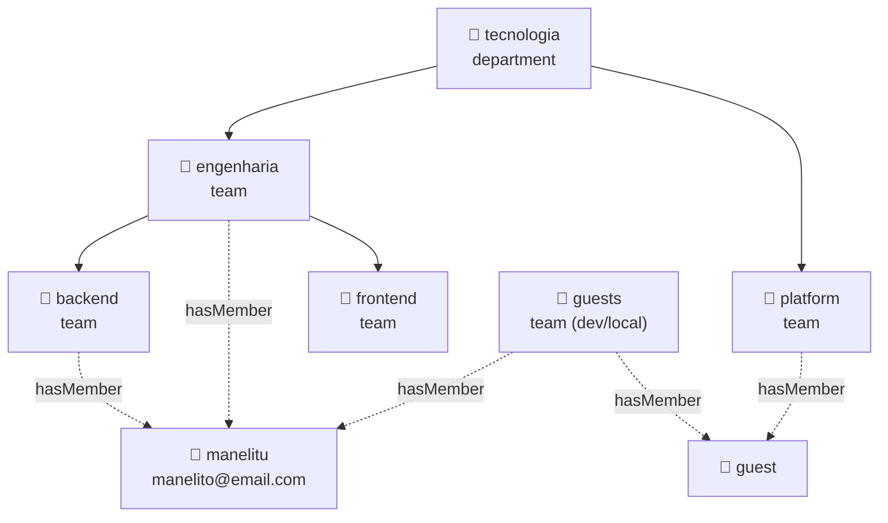

# Backstage Software Catalog — Guia Completo de Relacionamentos

> Projeto: backstage-poc | Atualizado: 2026-05-08

---

## 1. O modelo mental correto

O Backstage organiza tudo em **duas camadas separadas**, conectadas por `OwnedBy / OwnerOf`:

```
╔══════════════════════════════════════════════════════════════════════════╗
║  CAMADA DE SOFTWARE  (o que você constrói)                               ║
║                                                                          ║
║   Domain ──► System ──► Component  ──► API                              ║
║                    └──► Resource                                         ║
╠══════════════════════════════════════════════════════════════════════════╣
║                    OwnedBy ▲  ▼ OwnerOf                                  ║
╠══════════════════════════════════════════════════════════════════════════╣
║  CAMADA DE ORGANIZAÇÃO  (quem constrói)                                  ║
║                                                                          ║
║   Group (root) ──► Group (business-unit) ──► Group (team)               ║
║                                                  └──► User               ║
╚══════════════════════════════════════════════════════════════════════════╝
```

**Regra de ouro:** você nunca escreve `relations:` no YAML. Você preenche campos
no `spec` e o Backstage gera os pares de relações bidirecionais automaticamente.

---

## 2. Todas as entidades e seus tipos

### Camada de Software

```
┌─────────────────────────────────────────────────────────────────────────┐
│  Kind: Domain                                                           │
│  Representa uma área de negócio (DDD). Agrupa sistemas relacionados.    │
│                                                                         │
│  Campos relevantes:                                                     │
│    spec.owner        → quem é responsável pelo domínio                  │
│    spec.subdomainOf  → se este domínio pertence a outro domínio         │
│                                                                         │
│  ⚠️  Domínios podem ser aninhados via subdomainOf!                      │
└─────────────────────────────────────────────────────────────────────────┘

┌─────────────────────────────────────────────────────────────────────────┐
│  Kind: System                                                           │
│  Coleção de entidades que cooperam para realizar uma função.            │
│                                                                         │
│  Campos relevantes:                                                     │
│    spec.owner   → time/usuário dono do sistema                          │
│    spec.domain  → domínio ao qual pertence                              │
└─────────────────────────────────────────────────────────────────────────┘

┌─────────────────────────────────────────────────────────────────────────┐
│  Kind: Component                                                        │
│  Um pedaço de software implantável (serviço, site, biblioteca...).      │
│                                                                         │
│  Types disponíveis:                                                     │
│    service   → backend, microserviço, worker                            │
│    website   → frontend, SPA, portal                                    │
│    library   → pacote npm, jar, gem reutilizável                        │
│                                                                         │
│  Campos relevantes:                                                     │
│    spec.owner          → time dono                                      │
│    spec.system         → sistema ao qual pertence                       │
│    spec.dependsOn      → outros components ou resources                 │
│    spec.providesApis   → APIs que este component expõe                  │
│    spec.consumesApis   → APIs que este component consome                │
└─────────────────────────────────────────────────────────────────────────┘

┌─────────────────────────────────────────────────────────────────────────┐
│  Kind: API                                                              │
│  Contrato de interface exposto por um component.                        │
│                                                                         │
│  Types disponíveis:                                                     │
│    openapi   → REST documentado com OpenAPI/Swagger                     │
│    asyncapi  → eventos/mensageria (Kafka, RabbitMQ...)                  │
│    graphql   → schema GraphQL                                           │
│    grpc      → Protocol Buffers                                         │
│                                                                         │
│  Campos relevantes:                                                     │
│    spec.owner      → time dono                                          │
│    spec.system     → sistema ao qual pertence                           │
│    spec.definition → o contrato em si (YAML, proto, etc.)               │
└─────────────────────────────────────────────────────────────────────────┘

┌─────────────────────────────────────────────────────────────────────────┐
│  Kind: Resource                                                         │
│  Infraestrutura que os components precisam para funcionar.              │
│                                                                         │
│  Types disponíveis:                                                     │
│    database   → PostgreSQL, MySQL, MongoDB...                           │
│    s3-bucket  → buckets de armazenamento                                │
│    cluster    → Kubernetes, ECS, etc.                                   │
│                                                                         │
│  Campos relevantes:                                                     │
│    spec.owner   → time responsável pela infraestrutura                  │
│    spec.system  → sistema ao qual pertence                              │
│                                                                         │
│  Components apontam para Resources via dependsOn.                      │
└─────────────────────────────────────────────────────────────────────────┘
```

### Entidades especiais

```
┌─────────────────────────────────────────────────────────────────────────┐
│  Kind: Template                                                         │
│  Scaffolder — define formulários e passos para criar novos projetos.    │
│  Não participa do grafo de relações de software.                        │
│  Usado pelo Backstage para gerar código, repos e registrar entidades.   │
└─────────────────────────────────────────────────────────────────────────┘

┌─────────────────────────────────────────────────────────────────────────┐
│  Kind: Location                                                         │
│  Um ponteiro para onde encontrar outros YAMLs de catálogo.              │
│  É o "index" do catálogo — referencia arquivos ou URLs.                 │
└─────────────────────────────────────────────────────────────────────────┘
```

### Camada de Organização

```
┌─────────────────────────────────────────────────────────────────────────┐
│  Kind: Group                                                            │
│  Representa um time ou unidade organizacional.                          │
│                                                                         │
│  Types disponíveis:                                                     │
│    root           → topo da hierarquia (empresa/org)                    │
│    business-unit  → divisão de negócio (ex: "Seguros Vida")             │
│    product-area   → área de produto (ex: "Plataforma Digital")          │
│    team           → time de desenvolvimento                             │
│                                                                         │
│  Campos relevantes:                                                     │
│    spec.parent    → grupo pai (cria childOf)                            │
│    spec.children  → grupos filhos (cria parentOf)                       │
│    spec.members   → usuários do grupo (cria hasMember)                  │
└─────────────────────────────────────────────────────────────────────────┘

┌─────────────────────────────────────────────────────────────────────────┐
│  Kind: User                                                             │
│  Um desenvolvedor ou pessoa da organização.                             │
│                                                                         │
│  Campos relevantes:                                                     │
│    spec.memberOf              → grupos aos quais pertence               │
│    spec.profile.displayName   → nome de exibição                        │
│    spec.profile.email         → e-mail                                  │
│    spec.profile.picture       → URL do avatar                           │
└─────────────────────────────────────────────────────────────────────────┘
```

---

## 3. Todos os pares de relações

```
╔══════════════════╦═══════════════════╦════════════════════════════════╗
║ Campo no spec    ║ Par de relações   ║ Exemplo                        ║
╠══════════════════╬═══════════════════╬════════════════════════════════╣
║ owner            ║ ownedBy           ║ component ──► group:backend    ║
║                  ║ ownerOf           ║ group:backend ──► component    ║
╠══════════════════╬═══════════════════╬════════════════════════════════╣
║ system           ║ partOf            ║ component ──► system:examples  ║
║ (em Component    ║ hasPart           ║ system:examples ──► component  ║
║  API, Resource)  ║                   ║                                ║
╠══════════════════╬═══════════════════╬════════════════════════════════╣
║ domain           ║ partOf            ║ system ──► domain:poc          ║
║ (em System)      ║ hasPart           ║ domain:poc ──► system          ║
╠══════════════════╬═══════════════════╬════════════════════════════════╣
║ subdomainOf      ║ partOf            ║ domain:seguros ──► domain:br   ║
║ (em Domain)      ║ hasPart           ║ domain:br ──► domain:seguros   ║
╠══════════════════╬═══════════════════╬════════════════════════════════╣
║ dependsOn        ║ dependsOn         ║ comp-a ──► comp-b              ║
║                  ║ dependencyOf      ║ comp-b ──► comp-a              ║
╠══════════════════╬═══════════════════╬════════════════════════════════╣
║ providesApis     ║ providesApi       ║ component ──► api:rest         ║
║                  ║ apiProvidedBy     ║ api:rest ──► component         ║
╠══════════════════╬═══════════════════╬════════════════════════════════╣
║ consumesApis     ║ consumesApi       ║ component ──► api:ext          ║
║                  ║ apiConsumedBy     ║ api:ext ──► component          ║
╠══════════════════╬═══════════════════╬════════════════════════════════╣
║ memberOf         ║ memberOf          ║ user:manel ──► group:eng       ║
║ (em User)        ║ hasMember         ║ group:eng ──► user:manel       ║
╠══════════════════╬═══════════════════╬════════════════════════════════╣
║ parent           ║ childOf           ║ group:eng ──► group:tech       ║
║ (em Group)       ║ parentOf          ║ group:tech ──► group:eng       ║
╠══════════════════╬═══════════════════╬════════════════════════════════╣
║ members          ║ hasMember         ║ group:eng ──► user:manel       ║
║ (em Group)       ║ memberOf          ║ user:manel ──► group:eng       ║
╚══════════════════╩═══════════════════╩════════════════════════════════╝
```

---

## 4. Grafo completo do seu projeto

```
╔══════════════════════════════════════════════════════════════════════════╗
║  CAMADA DE SOFTWARE                                                      ║
╠══════════════════════════════════════════════════════════════════════════╣
║                                                                          ║
║  DOMAIN: backstage-poc-domain  ◄──────────────────────────────────────  ║
║  owner → user:manelitu         │ subdomainOf (não usado ainda)           ║
║  │                             │                                         ║
║  │  ┌──────────────────────────┴────────────────────────────────┐        ║
║  │  │  SYSTEM: backstage-poc-system                             │        ║
║  │  │  owner → user:manelitu                                    │        ║
║  │  │                                                           │        ║
║  │  │  ├── COMPONENT: backstage-poc  (website)                  │        ║
║  │  │  │     owner → user:manelitu                              │        ║
║  │  │  │     [sem dependsOn declarado]                          │        ║
║  │  │  │                                                        │        ║
║  │  │  └── API: backstage-api-test  (openapi)                   │        ║
║  │  │        owner → user:manelitu                              │        ║
║  │  │        github → Manelitu/backstage-api-test               │        ║
║  │  └───────────────────────────────────────────────────────────┘        ║
║  │                                                                        ║
║  │  ┌────────────────────────────────────────────────────────────┐        ║
║  │  │  SYSTEM: examples                                          │        ║
║  │  │  owner → group:guests                                      │        ║
║  │  │                                                            │        ║
║  │  │  ├── COMPONENT: example-website  (website)                 │        ║
║  │  │  │     owner → group:guests                                │        ║
║  │  │  │     providesApis → example-grpc-api                     │        ║
║  │  │  │     dependsOn ──────────────────────────┐               │        ║
║  │  │  │                                         ▼               │        ║
║  │  │  ├── COMPONENT: example-backend  (service) │               │        ║
║  │  │  │     owner → group:backend               │               │        ║
║  │  │  │     providesApis → example-grpc-api ◄───┘               │        ║
║  │  │  │                                                          │        ║
║  │  │  └── API: example-grpc-api  (grpc)                          │        ║
║  │  │        owner → group:backend                                │        ║
║  │  └────────────────────────────────────────────────────────────┘        ║
╠══════════════════════════════════════════════════════════════════════════╣
║              OwnedBy ▲  ▼ OwnerOf  (user:manelitu ou groups)             ║
╠══════════════════════════════════════════════════════════════════════════╣
║  CAMADA DE ORGANIZAÇÃO                                                   ║
║                                                                          ║
║  GROUP: tecnologia  (department / root)                                  ║
║  │                                                                        ║
║  ├── GROUP: engenharia  (team)                                            ║
║  │     members → [manelitu]                                               ║
║  │     │                                                                  ║
║  │     ├── GROUP: backend  (team)                                         ║
║  │     │     members → [manelitu]                                         ║
║  │     │                                                                  ║
║  │     └── GROUP: frontend  (team)                                        ║
║  │           members → []                                                 ║
║  │                                                                        ║
║  └── GROUP: platform  (team)                                              ║
║        members → [guest]                                                  ║
║                                                                           ║
║  GROUP: guests  (team — acesso local/dev)                                 ║
║    members → [manelitu, guest]                                            ║
║                                                                           ║
║  USER: manelitu  ──memberOf──► [engenharia, backend, guests]              ║
║    email: manelito@email.com                                           ║
║    github: manelitu                                                       ║
║                                                                           ║
║  USER: guest  ──memberOf──► [platform, guests]                           ║
╚══════════════════════════════════════════════════════════════════════════╝
```

---

## 5. Diagrama Mermaid — Grafo completo



---

## 6. Diagrama Mermaid — Hierarquia organizacional



---

## 7. O que está faltando no projeto (oportunidades)

```
┌────────────────────────────────────────────────────────────────────┐
│ GAP IDENTIFICADO             COMO RESOLVER                         │
├────────────────────────────────────────────────────────────────────┤
│ backstage-poc sem dependsOn  Adicionar spec.dependsOn se usar DB   │
│                                                                     │
│ Nenhum Resource declarado    Criar Resource para o banco SQLite/    │
│                              Postgres que o backend usa            │
│                                                                     │
│ backstage-poc sem consumesApis  Se o frontend chama backstage-api- │
│                                 test, declare consumesApis         │
│                                                                     │
│ Grupos sem type correto      Mudar "tecnologia" para type: root    │
│                              Adicionar business-unit para áreas    │
│                                                                     │
│ Domínio com dono individual  Produção: trocar user:manelitu por    │
│                              group:engenharia nos campos owner     │
│                              do domain e system principal          │
└────────────────────────────────────────────────────────────────────┘
```

---

## 8. Exemplos prontos para copiar

### Adicionar um Resource (banco de dados)
```yaml
apiVersion: backstage.io/v1alpha1
kind: Resource
metadata:
  name: backstage-poc-db
  description: Banco de dados do portal
spec:
  type: database
  owner: group:default/platform
  system: backstage-poc-system
```

E no `catalog-info.yaml` do Component:
```yaml
spec:
  dependsOn:
    - resource:default/backstage-poc-db
```

### Conectar o frontend à API (consumesApis)
```yaml
# em catalog-info.yaml (backstage-poc component)
spec:
  consumesApis:
    - backstage-api-test
```

### Criar um subdomínio
```yaml
apiVersion: backstage.io/v1alpha1
kind: Domain
metadata:
  name: plataforma-digital
spec:
  owner: group:default/engenharia
  subdomainOf: backstage-poc-domain   # ← cria partOf/hasPart entre domínios
```

### Novo usuário com perfil completo
```yaml
apiVersion: backstage.io/v1alpha1
kind: User
metadata:
  name: novo-dev
spec:
  profile:
    displayName: Nome Sobrenome
    email: nome@email.com
    picture: https://avatars.githubusercontent.com/novo-dev
  memberOf: [backend, guests]
```

---

## 9. Referência rápida

```
ENTIDADE      CAMPOS QUE CRIAM RELAÇÕES
──────────    ──────────────────────────────────────────────────────
Domain        owner, subdomainOf
System        owner, domain
Component     owner, system, dependsOn, providesApis, consumesApis
API           owner, system
Resource      owner, system
Group         parent, children, members
User          memberOf

FORMATO de referência entre namespaces:
  kind:namespace/name   →  component:default/meu-servico
  (dentro do namespace default, pode omitir: só "meu-servico")
```
